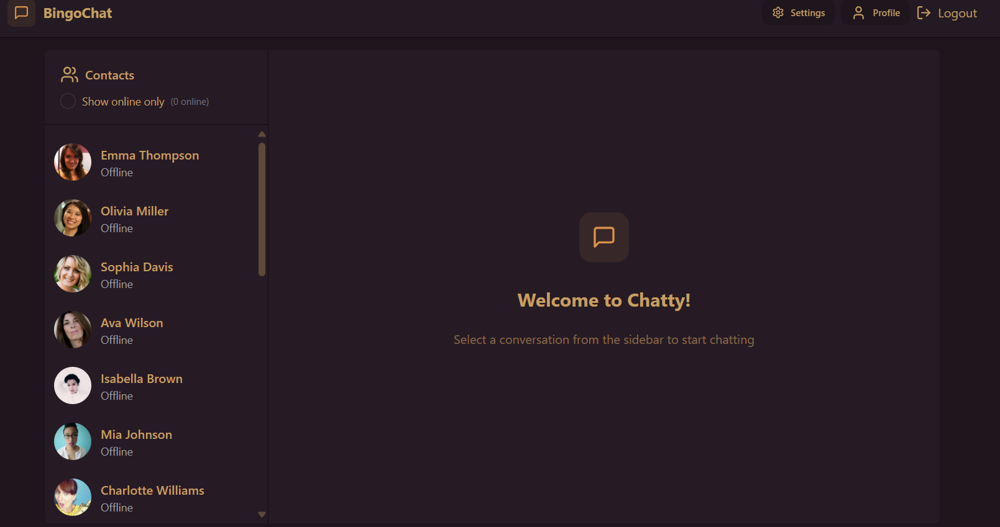
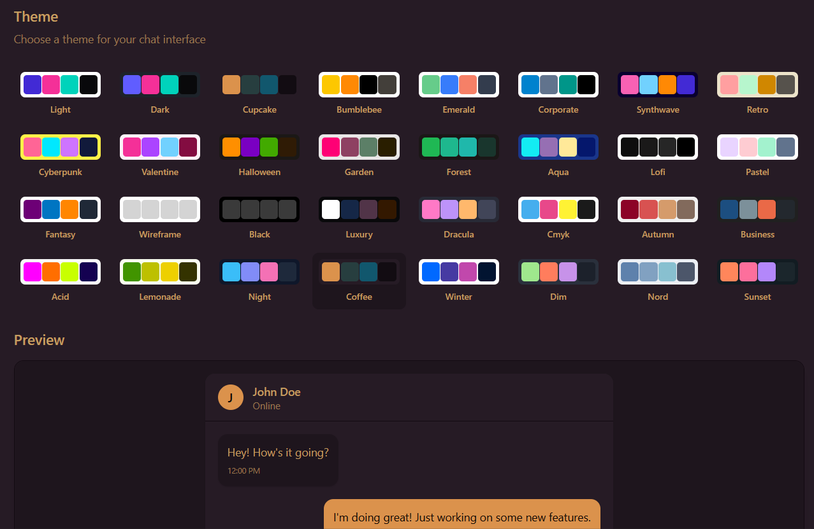
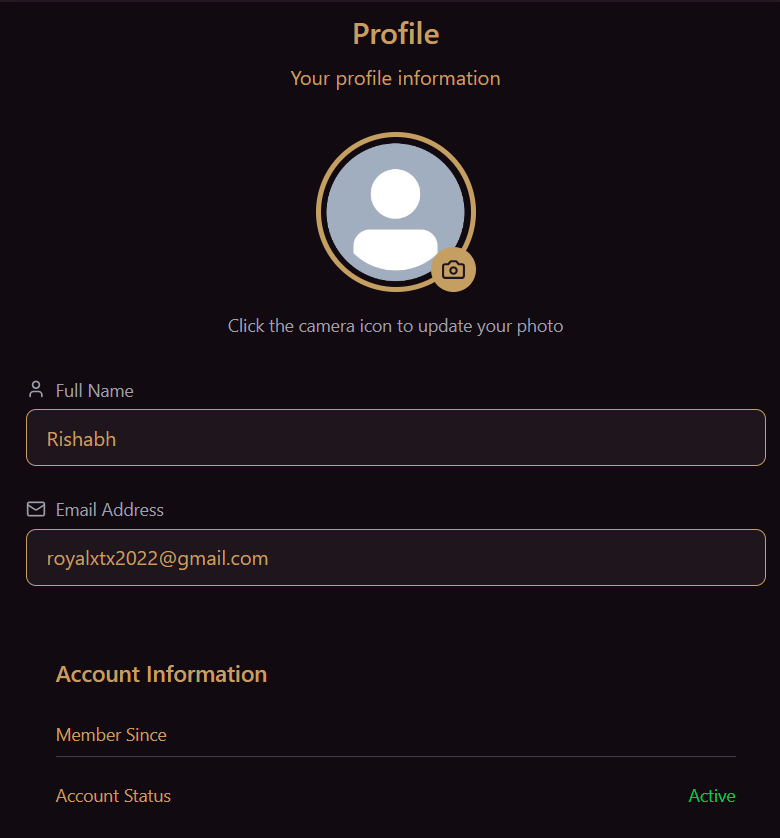

# 💬 Real Time Chat

A modern, full-stack real-time chat application built with **React**, **Vite**, **Tailwind CSS**, **DaisyUI**, **Node.js**, **Express**, **MongoDB**, and **Socket.io**.  
Seamlessly chat, share images, and connect with friends in a beautiful, themeable interface.


---

## 🚀 Features

- **Real-time Messaging:** Instant chat powered by Socket.io.
- **User Authentication:** Secure signup, login, and JWT-based session management.
- **Profile Management:** Update your avatar and personal info.
- **Image Sharing:** Send and preview images in chat.
- **Online Status:** See who’s online in your contacts.
- **Theme Switcher:** Choose from 30+ DaisyUI themes for a personalized look.
- **Responsive Design:** Works great on desktop and mobile.
- **Loading Skeletons:** Smooth UX with animated skeletons while loading.
- **Toast Notifications:** Friendly feedback for actions and errors.

---

## 🛠️ Tech Stack

**Frontend:**
- [React](https://react.dev/)
- [Vite](https://vitejs.dev/)
- [Tailwind CSS](https://tailwindcss.com/)
- [DaisyUI](https://daisyui.com/)
- [Zustand](https://zustand-demo.pmnd.rs/) (state management)
- [React Hot Toast](https://react-hot-toast.com/)
- [Lucide React](https://lucide.dev/) (icons)
- [Socket.io-client](https://socket.io/)

**Backend:**
- [Node.js](https://nodejs.org/)
- [Express](https://expressjs.com/)
- [MongoDB](https://www.mongodb.com/)
- [Mongoose](https://mongoosejs.com/)
- [Socket.io](https://socket.io/)
- [Cloudinary](https://cloudinary.com/) (for image uploads)
- [JWT](https://jwt.io/) (authentication)
- [bcryptjs](https://www.npmjs.com/package/bcryptjs)

---

## 📂 Project Structure

```
Real time Chat/
│
├── backend/
│   ├── src/
│   │   ├── controllers/
│   │   ├── lib/
│   │   ├── middleware/
│   │   ├── models/
│   │   ├── routes/
│   │   ├── seeds/
│   │   └── index.js
│   ├── .env
│   └── package.json
│
├── frontend/
│   ├── public/
│   │   ├── avatar.png
│   │   ├── screenshot-for-readme.png
│   │   └── vite.svg
│   ├── src/
│   │   ├── assets/
│   │   ├── components/
│   │   ├── constants/
│   │   ├── lib/
│   │   ├── pages/
│   │   ├── store/
│   │   ├── App.jsx
│   │   ├── main.jsx
│   │   ├── App.css
│   │   └── index.css
│   ├── index.html
│   ├── package.json
│   └── vite.config.js
│
├── package.json
└── .gitignore
```

---

## ⚡ Getting Started

### 1. **Clone the Repository**

```bash
git clone https://github.com/your-username/real-time-chat.git
cd "Real time Chat"
```

### 2. **Setup the Backend**

```bash
cd backend
cp .env.example .env   # Create your .env file with MongoDB, JWT, and Cloudinary credentials
npm install
npm run dev            # Starts backend on http://localhost:5001
```

### 3. **Setup the Frontend**

```bash
cd ../frontend
npm install
npm run dev            # Starts frontend on http://localhost:5173
```

### 4. **Seed Demo Users (Optional)**

```bash
cd ../backend
node src/seeds/user.seed.js
```

---

## 🔑 Environment Variables

Create a `.env` file in `/backend` with:

```env
PORT=5001
MONGODB_URI=your_mongodb_connection_string
JWT_SECRET=your_jwt_secret
CLOUDINARY_CLOUD_NAME=your_cloudinary_cloud_name
CLOUDINARY_API_KEY=your_cloudinary_api_key
CLOUDINARY_API_SECRET=your_cloudinary_api_secret
NODE_ENV=development
```

---

## 🖼️ Screenshots

| Chat UI | Theme Switcher | Profile |
|---------|----------------|---------|
|  |  |  |

---

## 🎨 Customization

- **Themes:**  
  Change your chat’s look instantly from the settings page (30+ DaisyUI themes).
- **Profile Picture:**  
  Upload a new avatar from your profile page.
- **Add More Users:**  
  Use the seed script or register new accounts.

---

## 🙌 Credits

- [DaisyUI](https://daisyui.com/) for beautiful themes.
- [Lucide Icons](https://lucide.dev/)
- [Cloudinary](https://cloudinary.com/) for image hosting.
- [RandomUser.me](https://randomuser.me/) for demo avatars.

---

## 📄 License

MIT License

---

## 👤 Author

**Rishabh Rajak**  
[GitHub](https://github.com/Rishabh028) | [LinkedIn](https://www.linkedin.com/in/rishabh-rajak-621318316/)

---

> _Built for learning, collaboration, and fun!_
